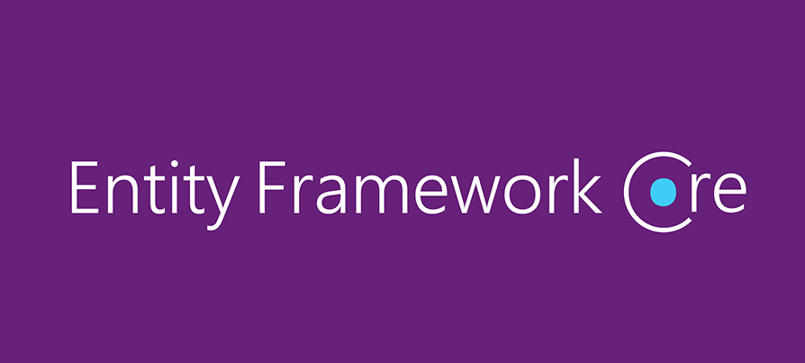
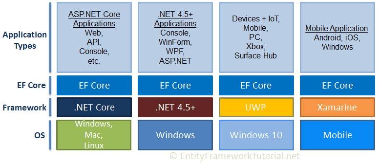

.jpg>)

# ORM Nedir ve ORM Aracları
- Veritabanların ve uygulamadaki nesnelerin birbirine bağlanmasıdır. Replika diyebiliriz.
- Object Relation Mapping olarak tam adıyla anılır.
- Backend'lerde kullandığımız araçlara ORM araçları diyoruz.
- ORM araçları veritabanı ile uygulama arasında köprü görevi görür.

## Yaygın ORM Araçları
- Entity Framework ve Core
- Hibernate
- Dapper
- Drizzle
- Prisma

## Avantajlar
- Nesne yönemli kod destekler.
- Açık kaynaktır.
- Db işlemleri kısaltır.

## Dezavantajlar
- Performans sorunları olabilir.
- Oluşturulan sql koduna müdahele sınırlıdır.
- Her orm yapısı farklı olduğunda öğrenme süresi uzayabilir.

## ORM Model Yaklaşımları
- DB First (İlk veritabanı oluşturulur sonra nesneye dönüştürülür)
    - kompleks veri tabanlarında kullanılır. DB bağımlılığı yüksektir.
- Code First (İlk nesneler oluşturulur ve orm aracılığıyla tablolar dahil ilişkiler yaratılır)
    - Kod tarafında yönetimi kolaydır.
    - Agile ve Domain Driven Design prensiplerine uygun projeler için idealdir.
    - DB tarafında kompleks yönetimdir ve Entegrasyon zor olabilir.
- Model First (İlk model oluşturulur, sonra veritabanı ve kod nesneleri üretilir) 
    - DB ve Kod arasında eş zamanlı bir model oluşturmaktadır
    - UML Kullanılarak veritabanı ve kod arası uyum sağlanır.
    - Model yönetimi ve güncellemesi zordur.

# Entity Framework Core

- Microsoft tarafından sunulmuş DataAccess teknolojisidir.
- Yıllar içerisinde olgunlaşarak 6x ve sonrası core adı altında birleşmiştir.
- Cross platform ve open source'dur.
- Net Core uygulamalarında kullanılmak üzere tasarlandı ama Net framework 5.0+ versiyon uygulamalarda Entity Framework kullanılablir durumdadır.

## Entity Framework Core Kullandığı Platformlar
